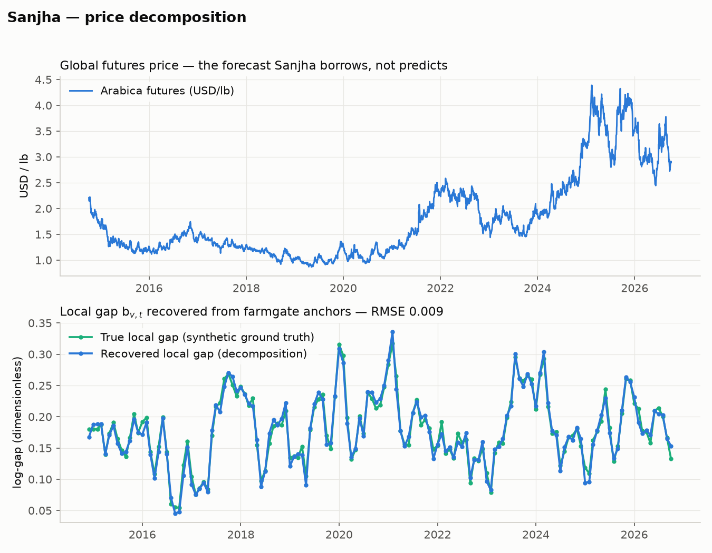
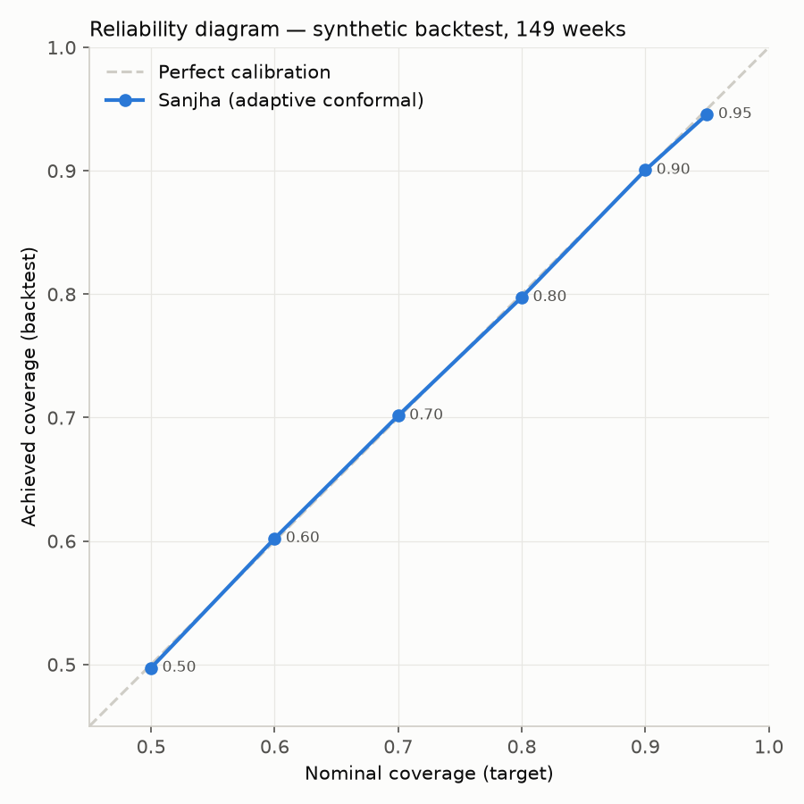
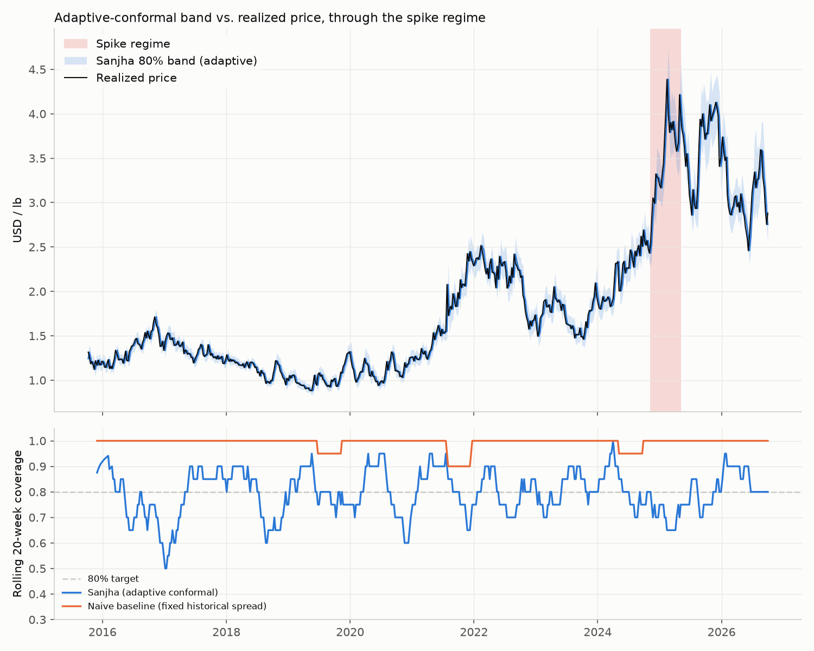
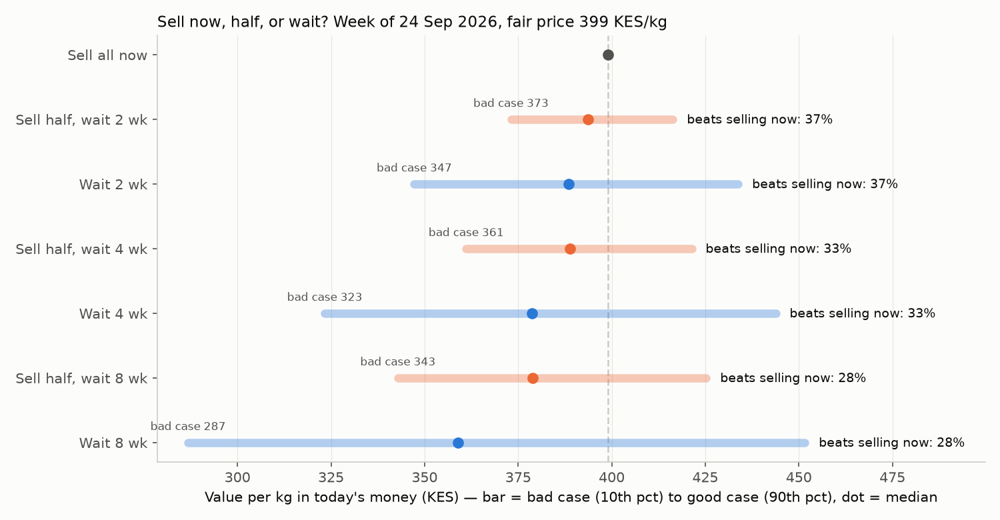
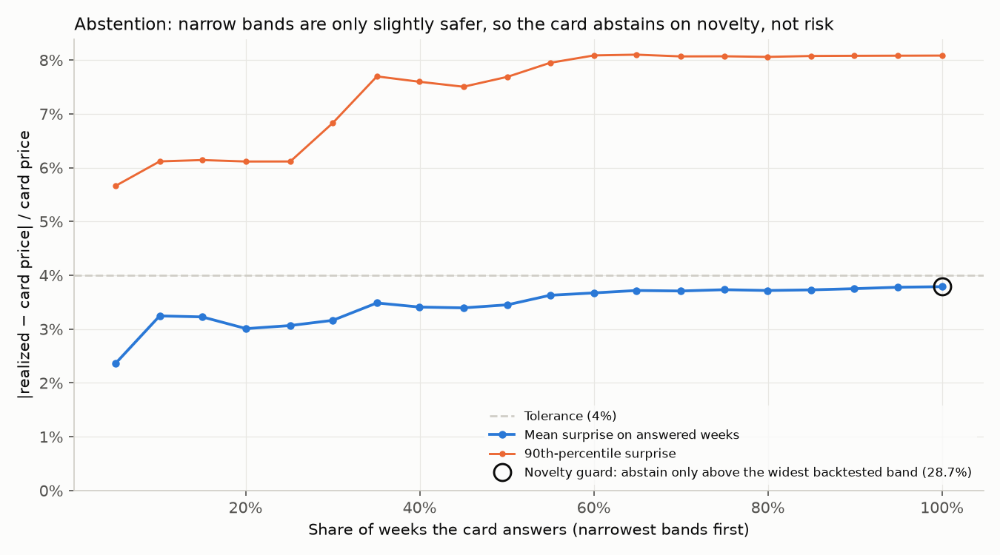
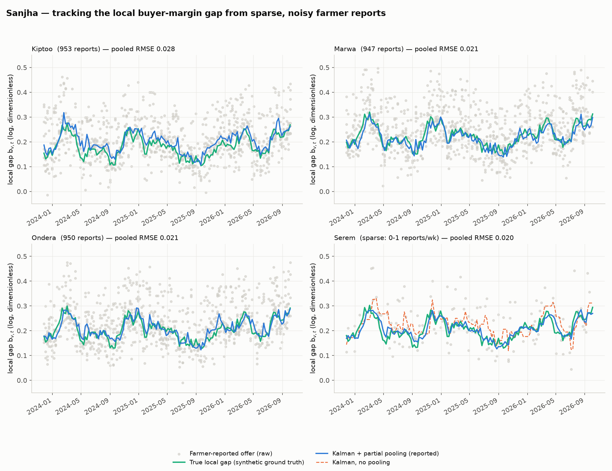
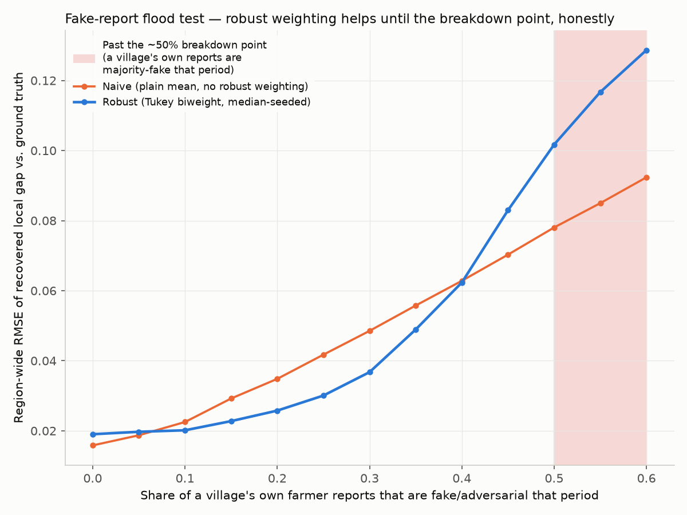

# Sanjha — data, forecast, backtest, local-gap tracking, decision layer, live SMS/USSD loop, offline web app
https://sanjha.onrender.com

Session 1 (hours 0-8): data pull, price decomposition, GARCH volatility,
adaptive conformal calibration, and the backtest/scoring harness. Session 2
(hours 8-11): the local-gap Kalman filter + village partial pooling
("Vand Chhako"), robust to adversarial/fake farmer reports, plus a
secondary WFP/FAOSTAT grounding-data module (`data/grounding.py`). Session 3
(hours 11-13): the decision layer ("sell now / sell half / wait", with
P(waiting pays) and a bad-case outcome) and the abstention curve. See the
"Sanjha: Build Reference" doc for the full architecture and math this
implements, and "Sanjha: Pitch & Judging Notes" for the judge-facing
narrative.

## Run the whole thing

```
./run.sh
```

Pulls data, refits the forecast, compiles `app/model.json`, seeds a demo
database with synthetic shared offers, runs the end-to-end test, and serves
the app at http://localhost:8000 (`./run.sh serve` skips the rebuild).

What is at that address:

- **Card** — this week's SMS card for a village (Swahili + English gloss)
  and a fan chart of the next 8 weeks.
- **Sell or wait** — the three choices with odds and bad case; sliders for
  the offer on the table and the farmer's cost of cash.
- **Share** — the Kalman update running on the phone: add offers, watch the
  range narrow.
- **SMS simulator** — type what a farmer would text; it hits the same
  `POST /sms/incoming` endpoint Africa's Talking calls.
- **Cooperative** — per-village reporters, offers set aside by the robust
  filter, the latest shared offers.

The first three work with no connection once the page has been opened once
(service worker + saved copies of every village's card). Verified by
stopping the server and reloading: the saved card, chart and sliders render
and the header says "offline — saved card".

### The live loop (sessions 4-5, hours 13-19)

```
app/
  build_model.py   compiles forecast state + track record + decision inputs
                    + intent classifier into app/model.json (41 KB)
  store.py         SQLite; salted-hash phone ids; the per-report robust
                    Kalman gap filter; k-anonymity (5 reporters) before a
                    village's own estimate is used
  main.py          FastAPI: /sms/incoming, /ussd (Africa's Talking shapes),
                    /api/card, /api/model.json, /api/dashboard,
                    /api/officer/report
  seed.py          synthetic shared offers for the demo database
  web/             offline web app: vanilla JS, canvas fan chart, service worker
sms/
  templates.py     every message Sanjha can send (fixed; 160-char checked)
  classifier.py    intent classifier: train (scikit-learn) + pure-Python predict
  card.py          card / report reply / wait reply from model + gap estimate
voice/build_clips.py      build-time ElevenLabs clip library (35 clips)
tests/test_live_loop.py   end-to-end checks against a throwaway database
```

See `DATA.md` for every dataset with source, licence, size and what it does
not cover.

- **No model fitting, no LLM and no generated text at run time.** The server
  reads `model.json` and fills fixed templates.
- **Intent classifier**: TF-IDF + logistic regression, 97% (35 of 36) on a
  hand-written test set. It is trained
  only on template-expanded synthetic messages, and the test set was written
  by the same non-native author, so that figure is an upper bound. Amazon
  MASSIVE (sw-KE) is not used yet.
- **What the end-to-end test checks**: each intent gets the right fixed
  template under 160 characters and never an instruction to sell or hold;
  six farmers sharing narrows a village's range (370-470 to 380-460); a
  village under 5 reporters only gets the regional estimate; ten reports
  from one phone count once; ten phones reporting an absurd price do not
  move the estimate; USSD menus; officer entry needs a token; no raw phone
  number reaches the database; the abstention path.
- **A genuinely low offer is answered but does not move the estimate.**
  "wamenipa 340" against a 380-460 range gets the "below the fair price, ask
  the cooperative" reply and shows on the dashboard as set aside. That is
  deliberate (offers are opening bids; the fair price should not chase
  lowballs), but it also means a coordinated, only-slightly-low flood would
  get through — the limit already documented for the batch filter.

Not done, and why:

- **Africa's Talking is not connected.** The endpoints accept AT's callback
  fields and replies are sent through AT's API when `AT_USERNAME` and
  `AT_API_KEY` are set, but that path has never been run against the real
  sandbox — it needs your account.
- **Swahili templates are unreviewed.** Only the card and abstention lines
  come from the build reference; the other nine were drafted here.
- **Voice clips are generated, except one.** `voice/build_clips.py` built
  34 of 35 Swahili clips with ElevenLabs (312 KB total, `app/web/voice/`);
  the web app shows a "Sikiliza" button on the card and stitches them
  offline. `u4.mp3` ("nne" — four) came back empty — ElevenLabs sometimes
  returns a 0-byte body for a very short word. A guard against this
  (`MIN_CLIP_BYTES`, skip-and-retry) is written but not yet re-run against
  the API. No one has listened to the clips yet, and the terms for the
  ElevenLabs tier used have not been confirmed for commercial use (see
  DATA.md). Voice over a phone call to a basic phone is not built.
- **Agmarknet rerun** needs a data.gov.in key.
- Set `SANJHA_SALT` (phone hashing) and `OFFICER_TOKEN` before any real use.

## Important: which data is real

Every fetch function in `data/fetch.py` tries the REAL source first and only
falls back to `data/synthetic.py` (clearly labeled `source="synthetic"`
throughout) when that fails; both paths return the same schema.

As of session 3, on the author's laptop:

- **Futures are real**: daily KC=F from yfinance (12 years, converted from
  US cents/lb to USD/lb in `fetch_futures_yfinance`). Caveat: Yahoo's KC=F
  follows the expiring contract through its delivery month, so on about 39%
  of days it is a thinly traded contract (volume under 1,000 lots) with
  occasional squeezes of 6-14% in a day. Expired individual contracts are
  not available from Yahoo, so a proper most-active-contract series needs a
  licensed source.
- **FX is still synthetic**: FRED needs `FRED_API_KEY` in the environment.
  Set it and re-run — nothing downstream changes. The synthetic series is
  pinned to end at 129 KES/USD.
- **Farmgate anchors and the local gap are synthetic** (generated from the
  decomposition around the real futures series). There is no API for these;
  they need transcribed UCDA / Nairobi Coffee Exchange / cooperative payouts.

So the forecast-band and decision backtests below are real for the global
coffee price and synthetic for everything local. The Kalman/pooling results
are fully synthetic.

## Install

```
python3 -m venv .venv && .venv/bin/pip install -r requirements.txt
```

Use `.venv/bin/python` for the commands below. Without the `arch` package
the volatility model silently falls back to EWMA instead of GARCH.

## Layout

```
data/
  synthetic.py    synthetic futures/FX/local-gap/farmgate-anchor generator,
                   plus the multi-village region + farmer-reports generator
                   used to validate models/kalman.py
  fetch.py        real-data pull (yfinance, FRED) with synthetic fallback + CSV cache
  grounding.py    secondary WFP food-price (HDX) + FAOSTAT grounding data —
                   "problem is real" evidence per the brief's Section 7.2,
                   NOT an input to the GARCH/conformal engine. Network to
                   data.humdata.org / bulks-faostat.fao.org is blocked in
                   every environment this was built in (cloud sandbox AND
                   the author's own machine — an account-level policy, not
                   a sandbox limitation); every fetch function takes a
                   `local_path` so a hand-downloaded CSV/ZIP drops in with
                   zero code changes. Currently returns clearly-labeled
                   synthetic placeholders — pull real data before the demo.
models/
  decomposition.py   log P_farm = log F + log X + log k - b_v,t  (recovers b_v,t)
  volatility.py       GARCH(1,1) + EWMA fallback; horizon-h variance = sigma_F^2 * h
  conformal.py        adaptive conformal inference (Gibbs & Candes 2021)
  decision.py         sell now / sell half / wait: P(waiting pays), bad-case
                       (10th pct) outcome, abstention threshold picked from
                       the risk-coverage curve. Never ranks the choices.
  kalman.py           local-gap Kalman filter + village partial pooling
                       ("Vand Chhako"), robust (Tukey biweight) to fake
                       farmer reports — see its module docstring for the
                       full math and an honest account of what pooling
                       does and doesn't buy you
backtest/
  scoring.py       pinball loss, CRPS, Diebold-Mariano, coverage, reliability
                    curve, risk-coverage curve (abstention), Brier score
  run_backtest.py  orchestrates the weekly backtest, model vs. naive baseline
  run_decision_backtest.py  scores P(waiting pays) (Brier vs. climatology,
                    reliability table) and picks the abstention threshold
charts/
  make_charts.py        the session-1 demo artifacts (decomposition chart;
                         reliability diagram + coverage-through-spike)
  make_kalman_charts.py the session-2 demo artifacts (village gap-tracking
                         chart; fake-report flood test), reusing the same
                         validated categorical palette from the dataviz skill
  make_decision_charts.py  the session-3 demo artifacts (the three choices
                         with probabilities; the abstention curve)
```

## Run everything

```
python3 -m data.fetch              # pull/cache data
python3 -m models.decomposition    # recover the local gap, check vs. ground truth
python3 -m models.volatility       # rolling GARCH sigma
python3 -m models.conformal        # smoke test on synthetic Gaussian data
python3 -m backtest.run_backtest   # full backtest + scoring summary (JSON)
python3 -m charts.make_charts      # writes the 3 session-1 PNGs into charts/
python3 -m models.kalman           # local-gap Kalman + pooling validation (3 sections, see below)
python3 -m charts.make_kalman_charts  # writes the 2 session-2 PNGs into charts/
python3 -m data.grounding          # WFP/FAOSTAT grounding data (synthetic fallback — see note above)
python3 -m backtest.run_decision_backtest  # P(waiting pays) Brier scores + abstention curve
python3 -m models.decision         # this week's three choices, as a table
python3 -m charts.make_decision_charts     # writes the 2 session-3 PNGs into charts/
```

## What the backtest found (real KC=F futures, 553 weekly forecasts, Oct 2015 - Oct 2026)





- Coverage: Sanjha 79.7% vs. an 80% target; the naive "last price +/-
  historical spread" baseline overcovers at 99.3% — uninformatively wide.
  The reliability diagram sits on the diagonal from 50% to 95% nominal.
- Average relative band width: Sanjha 12.8% vs. baseline 27.5%. Real arabica
  moved 3.8% in a typical week.
- Pinball loss and CRPS: Sanjha beats the baseline on both tails and overall.
  Diebold-Mariano statistic on the CRPS differential: -10.1.
- **Through the 2024-25 spike (Nov 2024 - Apr 2025) coverage was 68%
  (17 of 25 weeks), below the 80% target.** Rolling 20-week coverage has
  dipped to 50-65% several times in the sample (2017, 2018, 2021, 2025) —
  see `charts/coverage_spike.png`.
- **Coverage is not even across band widths.** The narrowest fifth of bands
  miss 27% of the time and the widest fifth 10%: the GARCH sigma swings more
  than true volatility does. The 80% holds on average, not week by week.

### What changed in session 3 to make the volatility signal usable

On the first real-data run (3 years, 100 weeks) the GARCH sigma was nearly
flat and unrelated to the next week's move, so band width carried no
information. Three causes, three changes:

1. **Too little history.** The last two years are one long high-volatility
   regime; no backward-looking estimator (GARCH, EWMA, rolling) separates
   calm from wild weeks inside it. Over 12 years they do (Spearman of sigma
   with next week's absolute move about +0.19). `FUTURES_HISTORY = "12y"`.
2. **Flat sigma^2 * h scaling.** The weekly sigma is now GARCH's own 5-day
   forecast averaged over the week, so a one-day spike is not assumed to
   last all week.
3. **Conformal learning rate too high.** At gamma = 0.05 the quantile swung
   between 0.9 and 2.1 sigma in reaction to each miss and the narrowest
   fifth of bands missed 37% of the time. gamma = 0.01 holds the same overall
   coverage with a better pinball loss. The cost: it adapts more slowly, and
   spike-regime coverage is one week worse (17 vs. 18 of 25).

## What the decision layer found (session 3)




`models/decision.py` turns the band into the three choices. Waiting h weeks
pays if `P_{t+h}(1 - s_h) - c_h > P_t (1 + r)^h`; the future price is drawn
around today's fair price with spread `sigma_week * sqrt(h)` and shock shapes
bootstrapped from the model's own past standardized errors (symmetrized, so a
run of up-weeks is never extrapolated). Defaults — 0.5%/month storage loss,
KES 0.5/kg/week cost, 5%/month cost of cash — are placeholders to be set per
cooperative, not measured values.

- **P(waiting pays) is well calibrated.** Across five equal bins the stated
  probability and the observed frequency were 14% / 18%, 21% / 28%,
  26% / 26%, 30% / 34% and 35% / 34%
  (`backtest/cache/waiting_pays_reliability.csv`).
- **It beats climatology on the Brier score, by a little**: 0.200 vs. 0.207
  over 1,600 origin-horizon pairs (2, 4 and 8 weeks), a skill score of 0.03.
  Horizons overlap across weekly origins, so the effective sample is smaller
  than 1,600 and there is no significance test on this yet.
- What it says, in plain terms: at a 5%/month cost of cash, waiting beat
  selling now 28% of the time, and the model can tell a 15% week from a 35%
  week. That is the Burke et al. point, quantified.
- **Abstention: the curve now slopes the right way, but it is shallow.**
  The band's miss rate cannot be the risk measure (adaptive conformal holds
  it near 20% overall), so `risk_coverage_curve()` also reports the size of
  the surprise, `|realized - card price| / card price`, on answered weeks.
  Answering only the narrowest 20% of weeks gives a typical surprise of 3.0%;
  answering all of them gives 3.8% (`charts/risk_coverage.png`). The widest
  10% of weeks average 4.1% against 3.75% for the rest. So width identifies
  a calm fifth of weeks, but does not pick out the dangerous ones.
- **Decided policy: abstention is a novelty guard, not a risk filter.** The
  card stays silent only when this week's band is wider than any band the
  model has been scored on (currently 28.7%; this week's is 15.4%). The claim
  to make to judges is "we say so when the week is wider than anything we
  have been tested on" — not "we know which weeks are dangerous", which the
  curve above does not support.
- Run forward through the backtest with no look-ahead (after a 52-week
  warm-up), the guard would have abstained on 14 of 501 weeks. They include
  March-April 2020 and the first two weeks of August 2021. Typical surprise
  on those 14 weeks was 4.6% against 3.8% overall — in the right direction,
  but 14 weeks is too few to call it proven.
- This week (origin 24 Sep 2026, fair price 399 KES/kg, band width 15.4%):
  waiting beats selling now with probability 37% / 33% / 28% at 2 / 4 / 8
  weeks; the bad case for waiting 4 weeks is 323 KES/kg in today's money.
  See `charts/decision_choices.png`.

## What the local-gap Kalman filter + pooling found (synthetic region, 4 villages, 150 weeks)




`models/kalman.py` tracks b_{v,t} continuously between farmgate anchors from
sparse, noisy, sometimes-adversarial farmer-reported offers, as a two-level
hierarchical Kalman filter: a region-level filter (fed by all villages'
reports pooled together, smoothing out single-period noise) and each
village's own filter, blended by precision-weighted partial pooling (the
time-integrated generalization of the architecture doc's
`b_hat_v = w_v*ybar_v + (1-w_v)*b_hat_region`).

- **Partial pooling helps, and the win is concentrated exactly where you'd
  want it.** Averaged over 25 random synthetic regions, pooling cuts
  region-wide RMSE by ~14% and cuts RMSE for a chronically sparse village
  (0-1 farmer reports/week) by ~27-30%, with no adversarial contamination in
  this check. This result is NOT automatic — an earlier draft of the
  synthetic village generator gave each village a fully independent random
  walk, and under that (unrealistic) assumption pooling made things worse,
  not better. Pooling only helps when villages genuinely share a regional
  driver underneath their differences, which is the realistic "Vand Chhako"
  premise (shared trader networks, shared fuel/transport costs) but should
  be checked against real reported-offer data, not assumed.
- **Robust (Tukey biweight) weighting beats a naive plain-mean filter while
  a village's own reports stay under roughly 30-40% fake**, and degrades
  toward (then past) the naive baseline as the adversarial share approaches
  its ~50% breakdown point — see `charts/flood_test.png`. That crossover is
  the honest, expected limit of a median-seeded M-estimator, not hidden.
- Full validation output (one concrete run, the flood-test sweep, and the
  25-seed pooling Monte Carlo) is reproducible with `python3 -m models.kalman`.

## What's NOT in this build yet

- **The Kalman filter is not wired into the price level.** The decision
  backtest uses a constant local gap (median recovered from the anchors);
  `backtest/run_backtest.py::combine_with_local_gap()` is still the hook.
  The live card's sigma does include the gap's weekly drift
  (`decision.weekly_log_sigma`), but not the filter's current estimation
  variance.
- **Value-of-information backtest** (a farmer who accepts any offer vs. one
  who refuses offers below the lower bound) — needs simulated offers.
- Voice clips and the Agmarknet rerun — see "Not done, and why" above.

## Known simplification, documented not hidden

Within the one-week card horizon the variance comes from GARCH's multi-step
forecast. Beyond one week the decision layer scales flat
(`sigma_week^2 * h`, no volatility mean-reversion), as the architecture doc
specifies — so an 8-week range after a volatile week is somewhat too wide.
